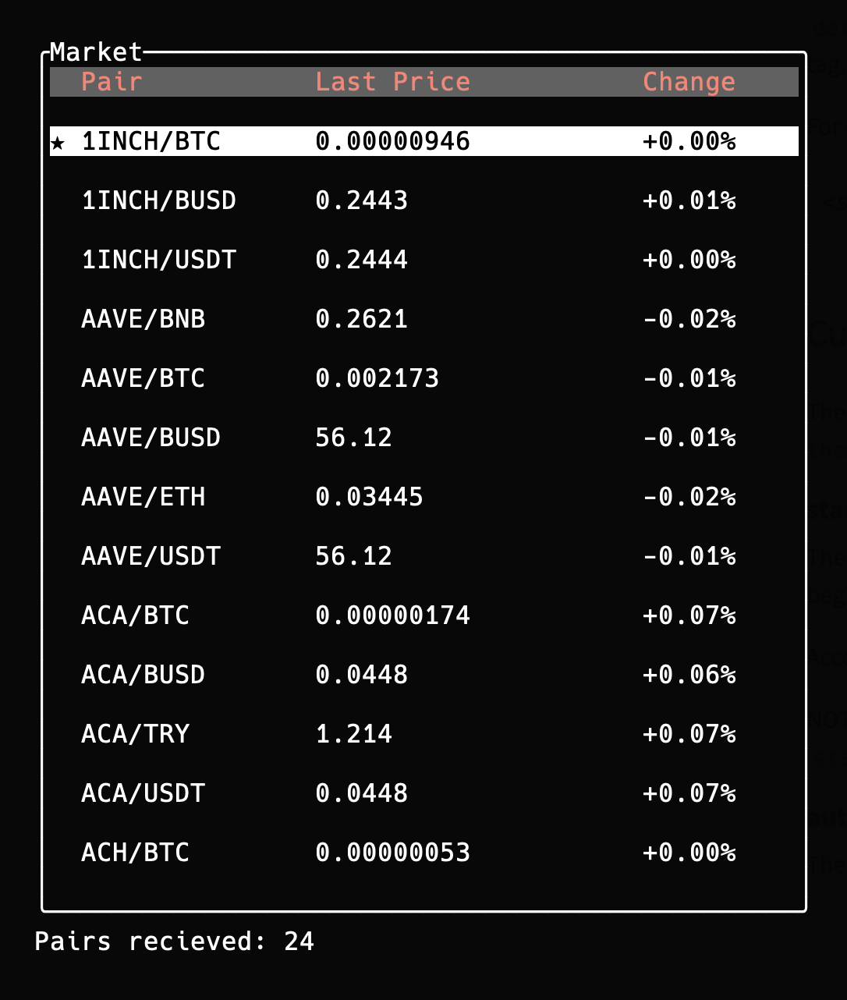

# Bi Widget Rust CLI

## Description
it is partly a Rust implementation of the ["bi-widget"](https://github.com/enemycnt/bi-widget), originally a React application.

## Features
- **Concurrency**: Leveraging Rust's capabilities for efficient data management.
- **WebSocket**: Fetching real-time product data through WebSocket connections.
- **TUI**: Utilizing the `ratatui` library for a seamless terminal user interface.

## Built with
- [Rust](https://www.rust-lang.org/)
- [Ratatui](https://github.com/ratatui-project/ratatui) - For UI rendering
- [Tokio](https://tokio.rs/) - Asynchronous runtime for Rust
- [Crossterm](https://github.com/crossterm-rs/crossterm) - For building cross-platform terminal applications
- [Serde](https://serde.rs/) - For serializing and deserializing Rust data structures


## Installation

To set up the BI Widget Rust CLI on your local machine, follow these steps:

- Ensure you have Rust and Cargo installed. You can download them from the [official site](https://www.rust-lang.org/tools/install).
- Clone the repository to your local machine.
- Navigate to the project directory in your terminal.
- Run the following command to install the necessary dependencies:
```sh
cargo run
```
